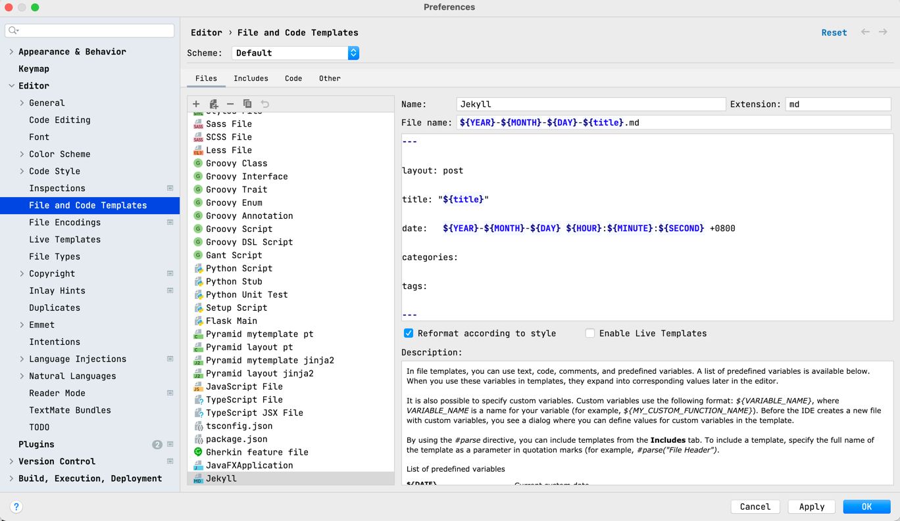

---

layout: post

title: "如何通过Jekyll模板加速文档编写"

date:   2022-07-22 15:53:48 +0800

categories:

tags:

---

1. 添加模板


   1. 打开配置页面（Preferences），可以使用 快捷键 Command + , 
   2. 搜索 "templates"
   3. 添加新的文件类型。比如 Jekyll
      1. 设置文件后缀，比如 md
      2. 设置文件名，比如 ${YEAR}-${MONTH}-${DAY}-${title}.md
      3. 设置文件内容，比如 
```
   
   ---
   layout: post
   
   title: "${title}"
   
   date: ${YEAR}-${MONTH}-${DAY} ${HOUR}:${MINUTE}:${SECOND} +0800
   
   categories:
   
   tags:
   
   ---
   
   
   ```


2. 把_drafts设置成 源文件夹