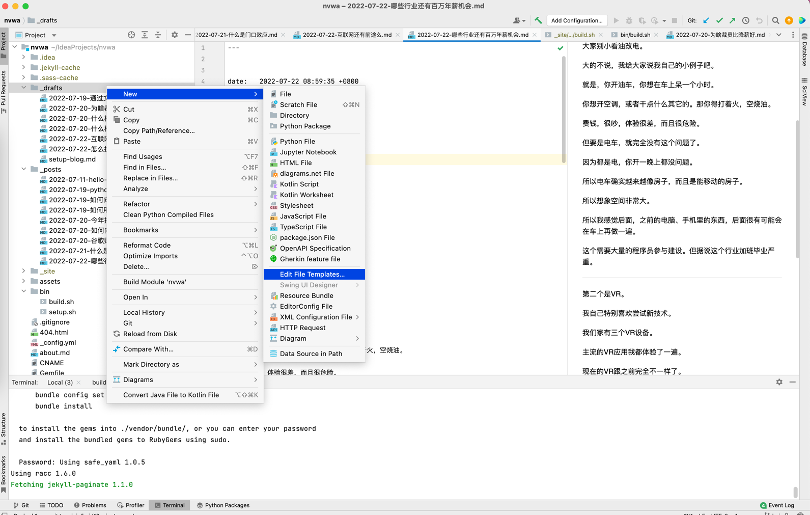

---

title: "通过文件模板快速写作"

date:   2022-07-24 16:44:15 +0800

categories:

tags:

---

工预善其事，并先利其器。

要长期坚持写作，一个好的体验非常重要。

所以，作为程序员，如何把写作这个事情自动化非常重要。

> Don't Repeat Yourself

我今天说一下，怎么用文件模板，来快速写作。

因为我们的文章都有很多有规律的东西。比如"时间"，还有标题。

这些东西，要是在一个博客平台，会自动获取，但咱用jekyll，就得自己手动写了。

这似乎很傻。所以怎么自动写时间呢？

还有每次文件名都不太好想。能不能自己用时间+标题来命名？

这些都可以。

我来说说怎么搞吧。

### 工具准备
首先，我们的写作环境是用IDEA。

所以我说的都是基于IDEA这个环境，

其它写作环境得自己想办法了。


### 创建文件模板
IDEA有一个文件模板的功能。



```yaml

---

title: "${title}"

date:   ${YEAR}-${MONTH}-${DAY} ${HOUR}:${MINUTE}:${SECOND} +0800

categories:

tags:

---

```