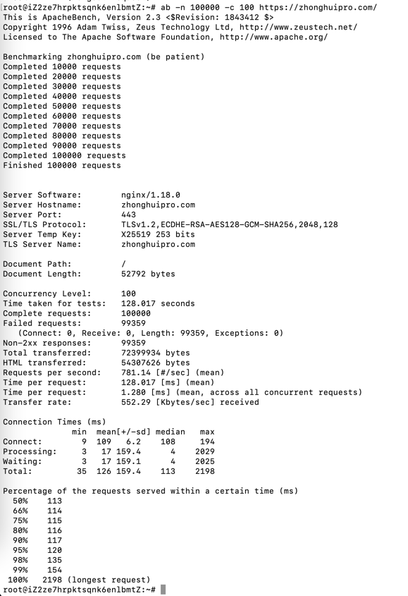
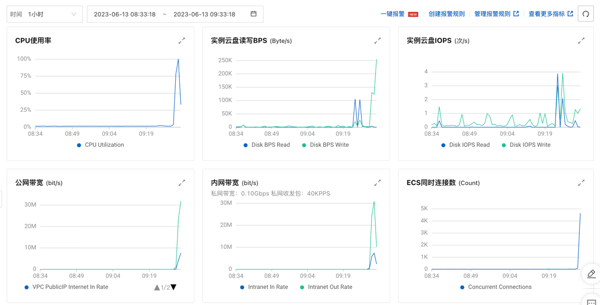
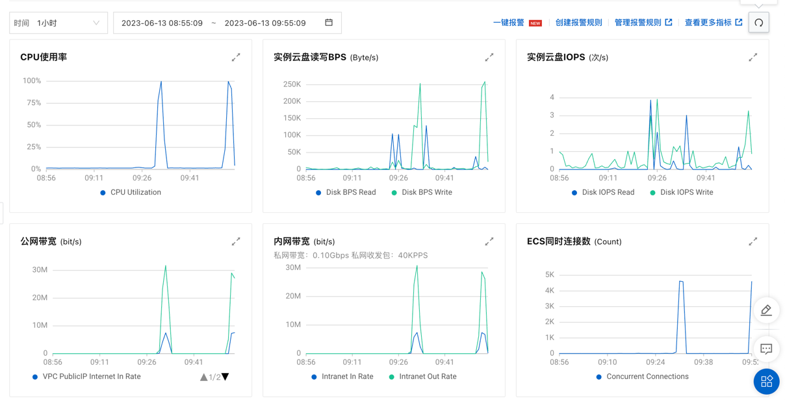

---

layout: post

title: "压力测试"

date: 2023-06-13 09:35:28 +0800

categories:

tags:
   
---

并发100，QPS 800

   



CPU还是飙高




看来限流没啥用

## 用nginx的ip限制
```bash
http {
    # 拒绝访问的IP地址
    deny 192.168.1.0/24;
    # 允许访问的IP地址
    allow all;

    server {
        # 其他配置
    }
}
```


还是飙高，不work。看来用nginx不靠谱了。