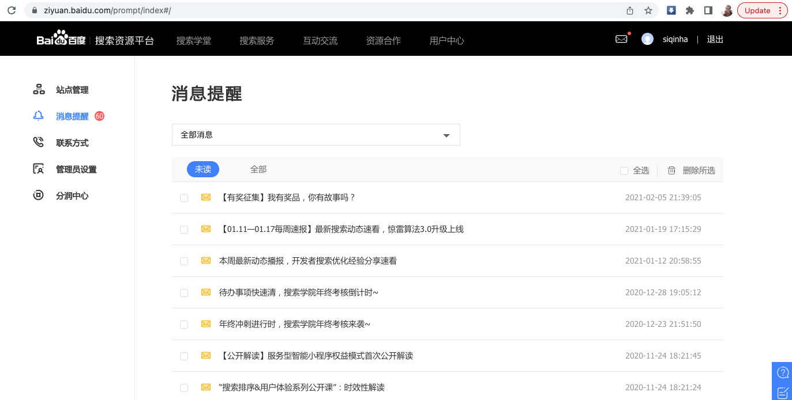

### 提交网站

百度搜索搜了半天也没看到入口。

然后仔细研究了一下，看样子。入口应该是这个网站：

<https://ziyuan.baidu.com/>

但看了一大圈，也没发现怎么提交。真是奔溃了。

最后一顿瞎点，最后发现原来入口在这里。

就是在这个右上角"消息提醒"那个图标。

然后点左边目录里的`站点管理`

然后就可以添加网站了。

其实就是这个网址：<https://ziyuan.baidu.com/site/index#/> 

### 添加链接

网站添加完之后，`资源提交/普通收录`就不是一个示例图片了。

如下图，选择 `资源提交/手动提交`

