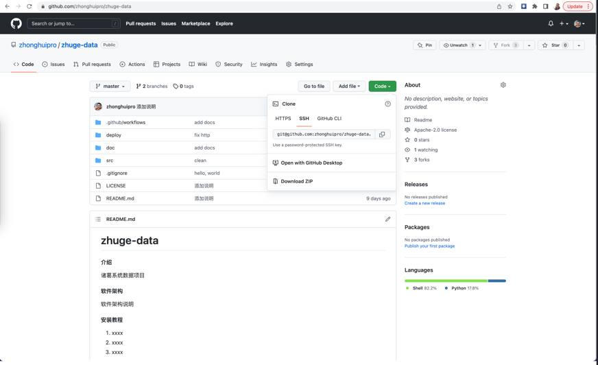
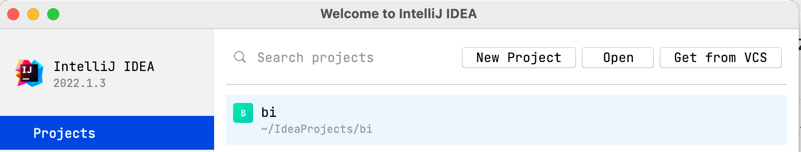
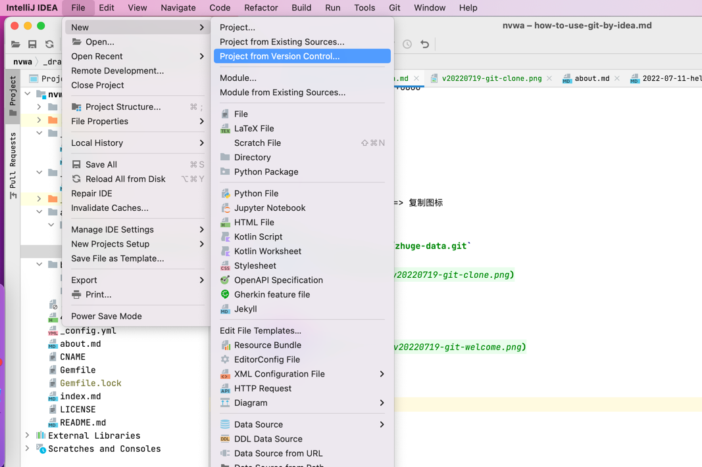
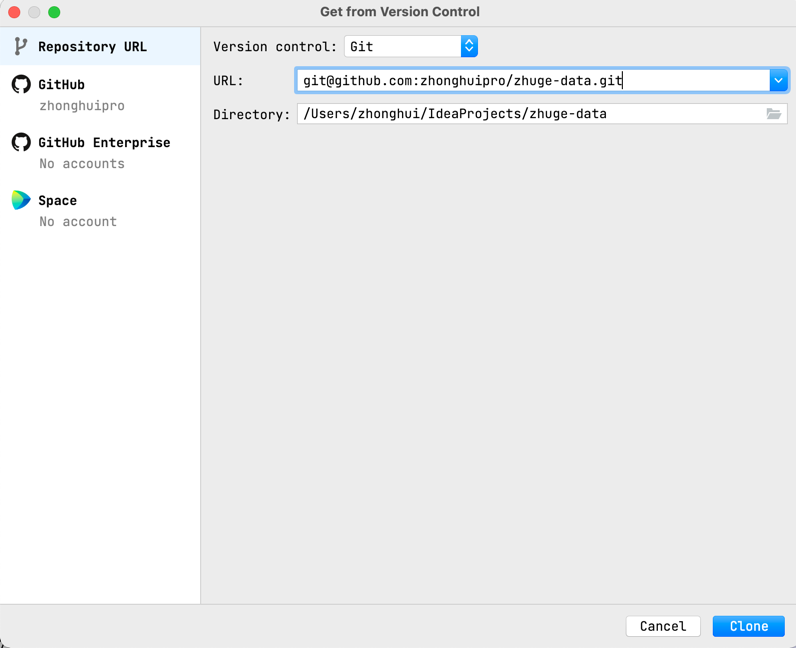

### 先找到仓库地址（ssh）

点击：仓库首页 => Code => SSH => 复制图标

得到仓库ssh址。例如
`git@github.com:zhonghuipro/zhuge-data.git`

### 新建项目

#### 1.1 如果是在欢迎页面

点击：Get from VCS

#### 1.2 如果已打开项目
点击：File => New => Project from Version Control

#### 2.1 clone项目

