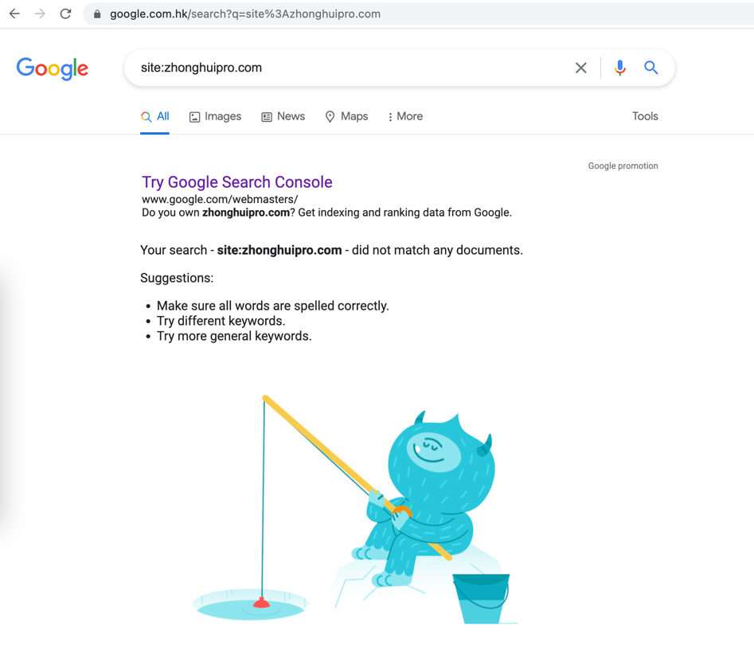
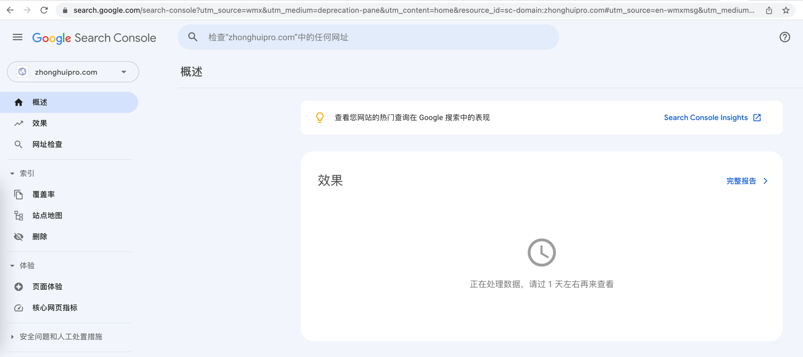

---

layout: post

title: "如何向谷歌提交收录请求"

date:   2022-07-20 08:34:18 +0800

categories: 博客

---

按我昨天写的 [如何向百度提交收录请求]()
看了一下，百度大佬好像还是没收录。

所以为了对比，今天特意查了一下谷歌有没有收录我的网站。

<https://www.google.com.hk/search?q=site%3Azhonghuipro.com>

好像并没有。

但提示我，如果这是我的网站，可以手动提交

打开 <https://search.google.com/search-console>
然后一路next，就OK了

最重要的，提示我，明天再来看数据。

这个太重要了。处女座的程序员，特别需要一个进度条。

