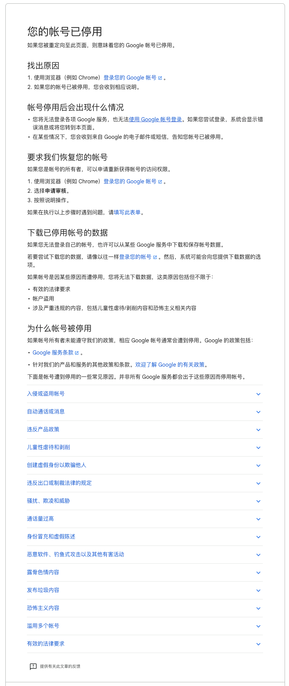

---

layout: post

title: "谷歌账号被禁用咋办"

date:   2022-07-20 11:33:40 +0800

categories: 日记 闲聊

---

之前注册的一个gmail邮箱，最近想用一下。

结果登录不了。

然后，重制了一下密码。

再登录的时候说已经被禁用了。

一脸蒙逼。

然后提示我可以申诉

那就申诉吧

为了保险起见，申诉还得写英文。抄个作业

> I am a user in China, and I can only access ~~GooglePlay~~  Gmail through ~~the proxy app (谷歌Space/XSpace)~~ VPN because my device doesn't have the GMS environment and Internet connection, and I really need ~~Google Play~~ Gmail.

谋事在人，成事在天。希望通通过。Good Luck！
