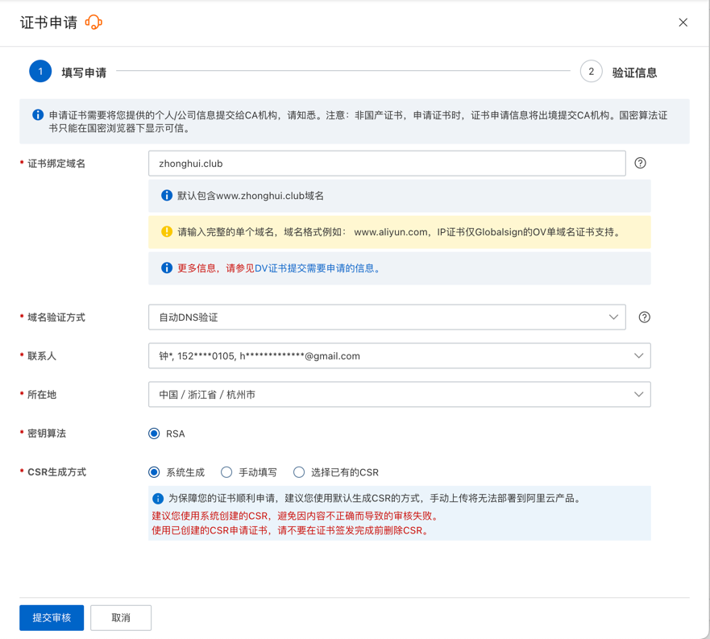
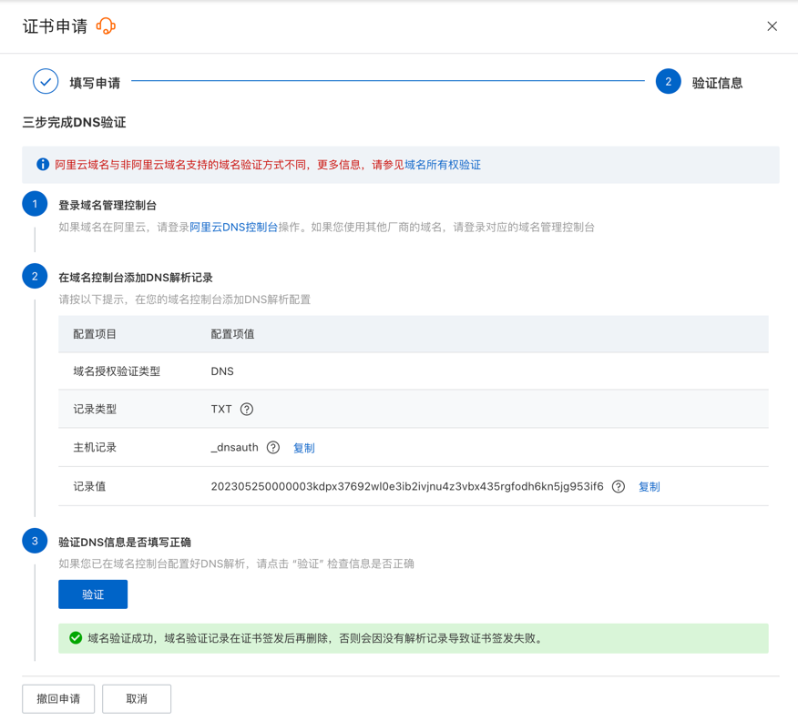
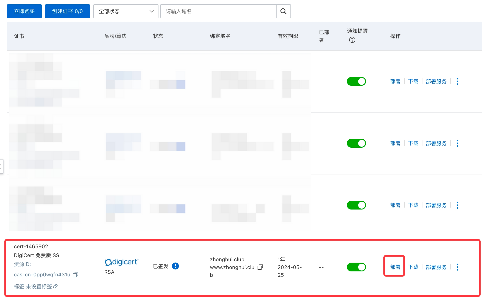
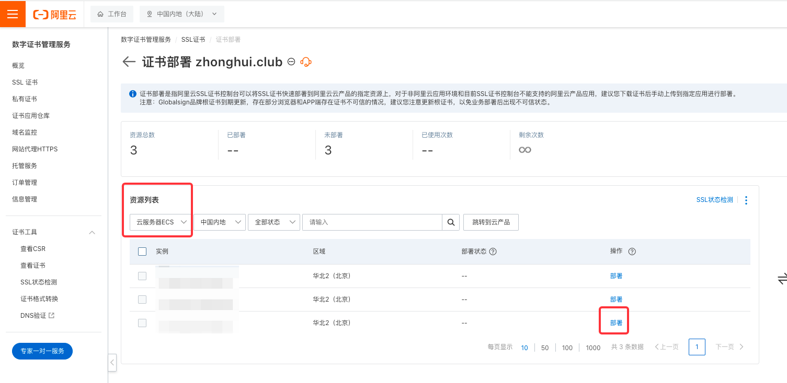
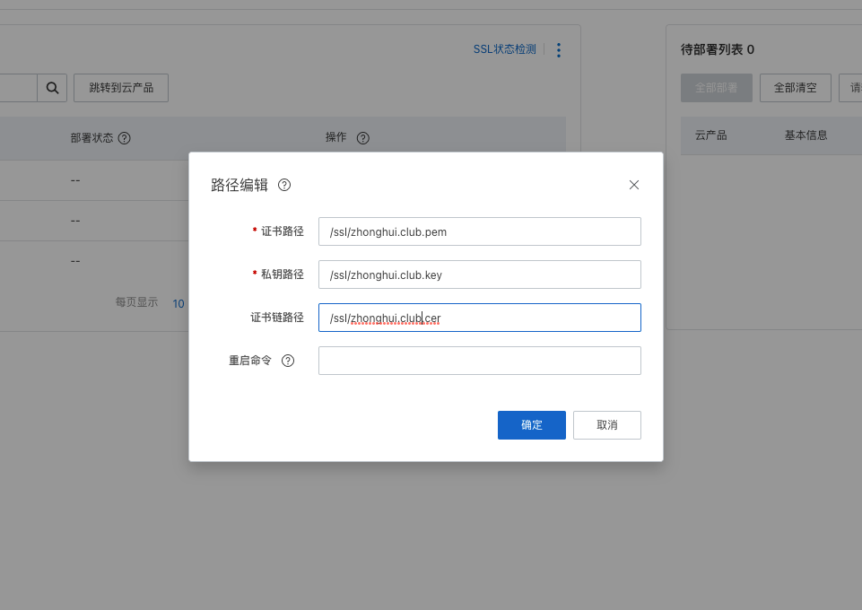

## 申请证书

1. 打开 证书管理

https://yundun.console.aliyun.com/?spm=5176.7968328.J_8413632810.4.594365c37ers5W&p=cas#/certExtend/free/cn-hangzhou

2. 证书申请



因为域名在阿里云，所以自动验证了



## 部署证书

1. 点击开始部署



2. 部署到阿里云主机



3. 设置复制位置


## 配置服务器

1. 设置nginx代理
添加新网站 /etc/nginx/sites-enabled/zhonghui.club

配置如下：

```bash
# Virtual Host configuration for example.cn
# 
# You can move that to a different file under sites-available/ and symlink that
# to sites-enabled/ to enable it.
#


server {
        listen 80;
        listen [::]:80;

        server_name zhonghui.club;


        location / {
                return 301 https://$server_name$request_uri;
                # proxy_pass http://127.0.0.1:1509;

        proxy_buffering off;

        proxy_http_version 1.1;
        proxy_set_header Connection "";

        }
}

server {
        listen 443 ssl;
        listen [::]:443;

        server_name zhonghui.club;

        ssl_certificate     /ssl/zhonghui.club.pem;
        ssl_certificate_key /ssl/zhonghui.club.key;

        ssl_session_timeout 5m;
        ssl_ciphers ECDHE-RSA-AES128-GCM-SHA256:ECDHE:ECDH:AES:HIGH:!NULL:!aNULL:!MD5:!ADH:!RC4;
        ssl_protocols TLSv1.1 TLSv1.2 TLSv1.3; #表示使用的TLS协议的类型。
        ssl_prefer_server_ciphers on;

        location / {
                index index.html index.htm index.php;
                proxy_pass http://127.0.0.1:1509;
proxy_buffering off;
                proxy_http_version 1.1;
                proxy_set_header Connection "";

#               try_files $uri $uri/ =404;
        }
}


```

核心配置 `ssl_certificate_key` 和 `ssl_certificate`

2. 重启nginx

`service nginx reload`