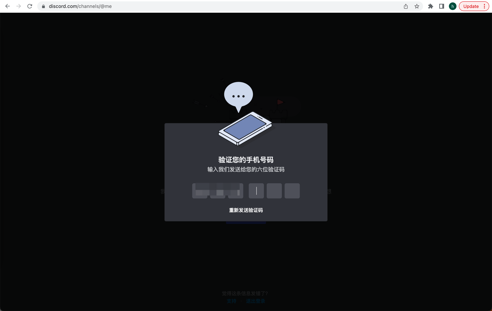
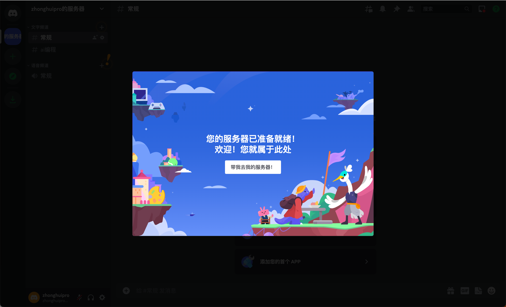

---

layout: post

title: "如何使用AI作画"

date: 2023-05-31 14:22:38 +0800

categories:

tags:
   
---

# 官方网址
https://docs.midjourney.com/

## 创建账号
https://discord.com/register

   

验证邮件

打开邮件

验证成功

还需要手机验证

开始验证

中国手机号也可以

偶尔需要验证是否机器人

输入验证码

确认密码

亲自创建

仅供我和我的朋友使用

自定义服务器名称

自定义话题

OK了

# 添加midjourney

搜索

搜索midjourney 或者 直接点击（一般在下面列表排第一）

添加机器人

设置服务器

授权

回到服务器，看到机器人加入了

输入/image看到提示词了

需要订阅才能使用了。点击订阅

# 订阅
购买页面

# 使用

## 漂亮女孩

## 程序员

## 殿图作画

先发一张图片

然后复制图片链接地址

生成图的时候贴上链接地址。另外有个参数 --iw 可以设置参考相似度 0~2

得到图片
