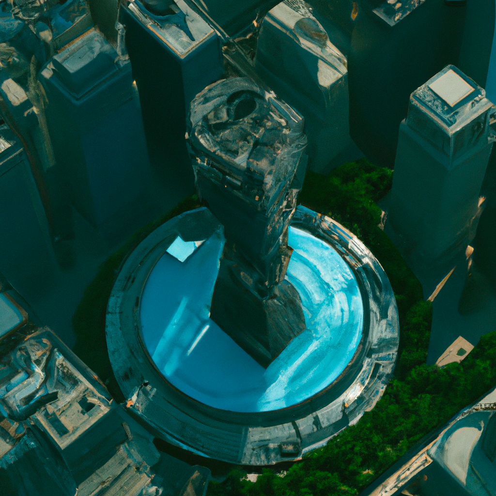

---

layout: post

title: "如何使用API作画"

date: 2023-06-01 15:13:59 +0800

categories:

tags:
   
---
   
openAI除了有AI聊天，还有很多AI工具，
其中影响力仅次于chatGPT，应该就是AI作画工具 DALL·E。
对标的应该就是midjourney。

web版的使用在这
https://labs.openai.com/

类似chatGPT，openAI也提供api接口

API 介绍文档在这
https://platform.openai.com/docs/guides/images/introduction

API 手册在这
https://platform.openai.com/docs/api-reference/images

接口有3个
1. 文本生图：根据文本描述生成对应图片。
2. 图修改：根据文本描述+原始图片+图片蒙版，生成一张新图。
新图在原图的基础上，根据文本描述，在蒙版位置作填充新内容。
3. 图微调：根据原始图生成微调的新图。

## 文本生图

核心代码如下
```python
def get_text_image_api(prompt, image_num=1, size="1024x1024", response_format="url"):
    """
    根据文本生成图片
    
    :param prompt: 文本参数
    :param image_num: 生成图片数量
    :param size: 生成图片尺寸，必须是 256x256, 512x512 或 1024x1024
    :param response_format: 返回内容格式。必须 url 或 b64_json
    :return:  图片结果
    
    """
    api_url = "https://api.openai.com/v1/images/generations"
    headers = {
        "Content-Type": "application/json",
        "Authorization": "Bearer " + os.getenv('API_KEY')
    }
    json_params = {
        "prompt": prompt,
        "n": image_num,
        "size": size,
        "response_format": response_format
    }
    proxies = {
        'http': os.getenv('PROXY_HTTP'),
        'https': os.getenv('PROXY_HTTPS')
    }
    # 使用stream方式发送请求
    response = requests.post(api_url, headers=headers, json=json_params, proxies=proxies, verify=False)
    return response
```

示例提示词
```text
aerial view of a giant fish tank shaped like a tower in the middle of new york city, 8k octane render, photorealistic
```

生成图片


示例提示词
```text
half-body portrait of a cyberpunk warrior,
super-realistic, half body, HDR, vivid color, Cinematic, super-details,
Unreal Engine, DOF, super resolution, megapixel, cinematic lighting,
anti-aliasing, CGI, VFX, SFX, hyper maximalist,
hyper-realistic, volumetric, photorealistic, fullcolor
```

生成图片


## 图片微调

核心代码如下
```python

def get_image_variations(source_image_path, image_num=1, size="1024x1024", response_format="url"):
    """
    根据图片生成微调图片

    :param source_image_path: 原图片文件路径
    :param image_num: 生成图片数量
    :param size: 生成图片尺寸，必须是 256x256, 512x512 或 1024x1024
    :param response_format: 返回内容格式。必须 url 或 b64_json
    :return:  图片结果

    """

    # 设置请求头，根据需要设置
    headers = {
        "Authorization": "Bearer " + os.getenv('API_KEY')
    }
    api_url = "https://api.openai.com/v1/images/variations"
    files = {
        "image": open(source_image_path, "rb"),
    }
    data = {
        "n": image_num,
        "size": size,
        "response_format": response_format,
    }

    # 使用stream方式发送请求
    response = requests.post(api_url, headers=headers, data=data, files=files, proxies=proxies, verify=False)
    return response

```

根据第一张图生成的另外2张图




根据第二张图生成的另外3张图


感觉有点吓人。。。

