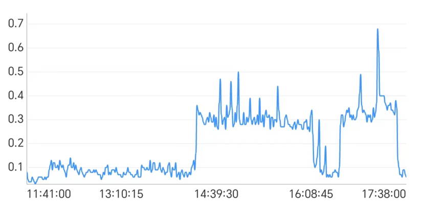
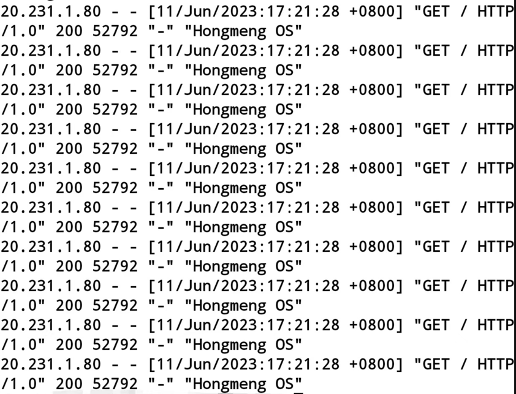

---

layout: post

title: "故障复盘-20230612-网站被恶意攻击导致系统不可用"

date: 2023-06-12 19:52:18 +0800

categories:

tags:
   
---
   
## 事故经过

2023年6月11日

14:30 开始

有大量请求，服务不可用

16:08 收到打不开网站的消息。因为人在外面，没带电脑。只能用手机登录github重启。网站恢复。

16:30 请求量又起来了。

17:38 拿到ip，在阿里云中 屏蔽ip。问题初步解决

## 事故影响

14:39~17:38 3个小时系统不可用。

## 事故定级

严重故障

## 故障原因

被恶意攻击，没有提交防护，没有第一时间修复。

## 优化措施

1. 增加预警（已完成）
2. 增加nginx流量限制（已完成）
3. 增加核心流程降级方案。遇到问题保障正在使用的用户。（待完成）
4. 服务拆分。（完成部分）
5. 安装github app，第一时间发布操作（已完成）。
6. 压力测试。
7. 增加请求统计。（完成部分）
