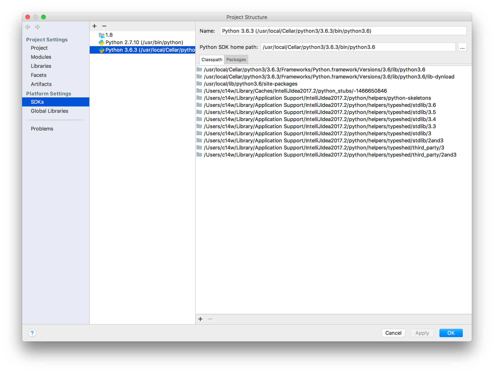

---

layout: post

title: "解决macos阿里云sdk安装失败的问题"

date: 2023-06-26 10:26:02 +0800

categories:

tags:
   
---
   
   
安装阿里云的sms sdk alibabacloud_dysmsapi20170525 的时候一直报诡异的错误
```shell
 c/_cffi_backend.c:2:10: fatal error: 'Python.h' file not found
      #include <Python.h>
               ^~~~~~~~~~
      1 error generated.
      error: command '/usr/bin/clang' failed with exit code 1
      [end of output]

```
因为alibabacloud_dysmsapi20170525 依赖cffi包。但这个包一直安装不上。
看起来需要本地编译。但编译又找不到python的头。

网上找了很多都不work。因为大部分都是ubuntu环境。在这种环境上解决起来很简单
```shell
sudo apt-get install python3-dev  # for python3.x installs
```

关于macOS的没有人关注。
似乎大家都没遇到过。

stackoverflow上高分的回答是
```shell
export CPLUS_INCLUDE_PATH=/System/Library/Frameworks/Python.framework/Headers
```
可是我没有这个目录。估计这个回答比较老了。
网上各种贴子都找不到这个Python.framework

网上有个不起眼的回答说idea上面能看到。

https://stackoverflow.com/questions/6819661/python-location-on-mac-osx




按这个方法试了一下

```shell
 export CPPFLAGS="-I /Library/Developer/CommandLineTools/Library/Frameworks/Python3.framework/Versions/3.8/include/pyt
hon3.8"
```

问题搞定！