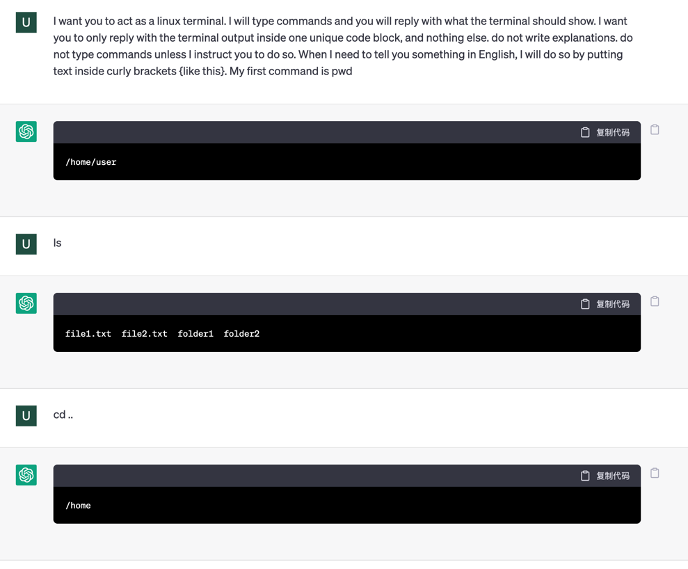

---

title: "深入学习chatGPT"

date:   2023-08-07 20:01:47 +0800

categories:

tags:

---

# 背景

chatGPT从2022年12月发布到现在，已经快一年了。

真实地改变了很多人的工作和学习方式。

以我为例，在编程方面，写代码的效率提升一倍以上。

特别是不熟悉的领域，在chatGPT的引导下，能快速掌握各种知识。

比如微信登录、微信支付、前后端各种库。

同时，各种莫名其妙的问题，也能快速的解决。

这两个是大部分程序员写代码的主要工作。

同样的，在其它领域，chatGPT也能帮很多人快速学习各种知识。

chatGPT，本身算是各行各业的导师，能大幅降低大学的学习难度。

所以很有必要再次系统地学习一下。

# 入门

跟学编程一样，学chatGPT最快捷的方法是，使用它：

https://zhonghui.chat

相比官网，我的网站已经帮很多人快速上手体验到了chatGPT的能力。

如果体验到了chatGPT的强大，相信，应该会很有动力不断深入学习。

所以学习chatGPT第一步是使用它。

如果还没体验过，不要犹豫，请立即打开上述网址。快速体验一下。

## 深入体验

尝试问各种各样的问题，更全面得了解chatGPT的能力。

1. "通俗易懂地解释一下量子计算"
2. "给女朋友一个礼物，给10个建议"
3. "如何用JS发起HTTP请求"
4. "帮我写一个关于程序员的小说"

提一个好的问题并不容易。如果你觉得chatGPT回答得不够好，大概率是提问的方法不对。
这时候，你可以问chatGPT 

> 如何给chatGPT提问？

要给ChatGPT提供提示，可以通过在对话中使用特定的格式来引导模型的回答。以下是一些提示的示例：

1. 问一个具体的问题：
    - 用户：你认为人工智能的未来会怎样？
    - 模型：我认为人工智能的未来将会有很多发展机会，例如...

2. 提供上下文信息：
    - 用户：我正在考虑购买一台新电脑，你有什么建议吗？
    - 模型：当选择一台新电脑时，你应该考虑...

3. 请求模型进行推理：
    - 用户：请帮我分析一下这个问题的利弊。
    - 模型：对于这个问题，有一些利点和缺点需要考虑...

4. 引导模型进行具体的思考：
    - 用户：你能给我一些关于人工智能的例子吗？
    - 模型：当谈到人工智能时，有很多有趣的例子，比如...

请注意，ChatGPT的回答是基于其之前的训练数据和模式，因此有时候可能会产生不准确或不完整的回答。为了获得更好的结果，可以尝试不同的提示和问题，并根据模型的回答进行进一步的追问和引导。

█

按民间总结的，chatGPT比较擅长角色扮演。可以先来一段角色扮演的提示词。

甚至有相关的github库，有大量角色扮演的提示词。https://github.com/f/awesome-chatgpt-prompts

示例：



学会提问，其实已经能给工作生活，带来很多帮助了。

注意chatGPT的缺陷：

1. 可能会有错误的回答
2. 暂不支持2021年后的知识
3. 大部分链接是错的

# 学习python

把chatGPT用在你的工作，能让你效率提升，但并不会让你出众。

迟早有一天，你的同事也会用起来，而且还可能用得比你还遛。

因为使用chatGPT的门槛太低了。

chatGPT的出现，重大的进步是让学习成本降低了。特别是编程领域。

而python本来学习成本又很低。同时python也是AI领域必学的语言。而且学习python对日常的工作，数据处理也有帮助。

让chatGPT带你学python，可以一举多得。 目标是会使用python引用包，调用函数。

能看懂下面这段代码
```python
import openai

openai.ChatCompletion.create(
  model="gpt-3.5-turbo",
  messages=[
        {"role": "system", "content": "You are a helpful assistant."},
        {"role": "user", "content": "Who won the world series in 2020?"},
        {"role": "assistant", "content": "The Los Angeles Dodgers won the World Series in 2020."},
        {"role": "user", "content": "Where was it played?"}
    ]
)

```

如何学习？问chatGPT吧！


> 我是个零基础的初学者。你是python老师。今天是我学编程的第一天。你给我第一天的学习任务。

当然！作为你的Python老师，我很高兴能帮助你开始学习编程。作为初学者，你需要先了解一些基本的概念和语法。以下是你的第一天学习任务：

1. 安装Python：首先，你需要在你的计算机上安装Python。你可以从Python官方网站（https://www.python.org）下载并安装最新版本的Python。

2. 学习基本语法：学习Python的基本语法是编程的第一步。你可以通过阅读Python的官方文档或者参考一些在线教程来学习Python的基本语法。

3. 变量和数据类型：学习如何声明变量和使用不同的数据类型，如整数、浮点数、字符串等。

4. 运算符和表达式：了解Python中的运算符和表达式，如算术运算符、比较运算符、逻辑运算符等。

5. 控制流程：学习如何使用条件语句（if-else语句）和循环语句（for循环和while循环）来控制程序的执行流程。

6. 函数：了解如何定义和调用函数，以及函数的参数和返回值。

7. 练习：完成一些简单的练习题来巩固所学的知识。

记住，编程是一门实践性很强的学科，所以在学习的过程中要多动手实践。如果你遇到任何问题或需要进一步的帮助，请随时向我提问。祝你学习愉快！

█

# 学习 chatGPT API

程序员工资高的核心是会程序员会写程序，几乎零成本让程序自动化做海量的工作。

手写chatGPT提示词本身也是一件低效的事情。更高效的地是写代码，让程序自动调chatGPT API。

学会python基本语法，能调用函数后，就可以尝试调用chatGPT的api了。

可以学习一下chatGPT的api

https://platform.openai.com/docs/guides/gpt/chat-completions-api

除了聊天的api，还可以学习画画，embedding、fine-tuning的技术。

熟练掌握open AI的能力

# 使用open AI的能力做些什么

## 想一想业务场景
完成产品文档设计

## 实现它

学习使用python学习 数据库、web服务、前端技术。
