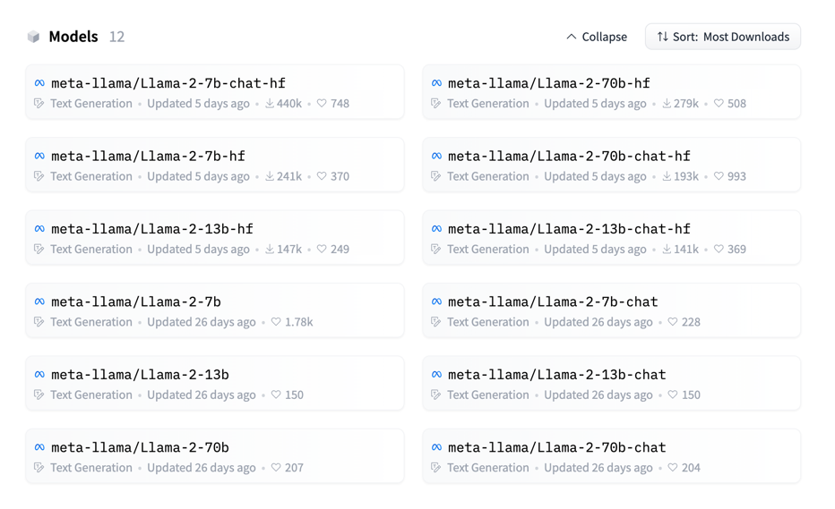
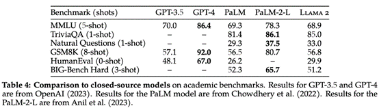
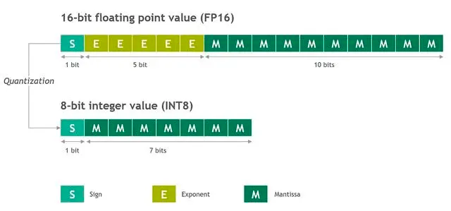

---

layout: post

title: "本地搭建AI聊天系统"

date: 2023-08-08 14:55:21 +0800

categories:

tags:
   
---

# 背景
有位网友让帮本地搭建一个模型。虽然预想到要地搭的模型肯定不如chatGPT的API调用效果好。

但既然要熟悉了解这一块，那就试试搭建一下吧。

# 目标
搭建一个本地（自己电脑）的AI聊天系统

# 方案

## 模型

本地的系统，肯定得用开源的。自己从头训练，得上亿的投入了。

所以只能拿现有的开源模型了。

开源的模型一般会上传到这网站

https://huggingface.co/

The AI community building the future.

The platform where the machine learning community collaborates on models, datasets, and applications.

上面有大量的开源模型，数据集。并且可以托管AI应用。

### 聊天模型

聊天模型有很多，比较著名的是meta的llama2（羊驼）。基于这个有很多派生的模型。xxxx驼。华驼。


模型主页

https://huggingface.co/meta-llama


开源的模型有



模型有三个大小的版本。

7B、13B和70B。代表参数数量。

1B(billion) = 1000M(million) = 1000 000 000 = 10亿

所以

7B = 70亿 参数

13B = 130亿 参数

70B = 700亿 参数。

然后，原始的 Llama-2-XXb模型，只是语言模型。一问一答。类似GPT3模型。

通过微调后，得到 Llama-2-XXb-chat模型。是聊天模型。支持上下文。类似ChatGPT。

不同参数的模型，效果会有差异，但没有差异那么大。像模型大小一样，10倍的差距。


据评测，70B-chat跟chatGPT差不多。除human eva（HUMANEVAL是OpenAI和Anthropic AI一起制作的代码数据集，包含164个原创编程题，涉及语言理解、算法、数学和软件面试几种类型的题目。）



当然，这些开源模型，主要是用英文。中文表现不是很好。

所以，找了一下加入中文语料，微调后的模型。

主要有两个

https://huggingface.co/LinkSoul/Chinese-Llama-2-7b

https://huggingface.co/FlagAlpha/Llama2-Chinese-7b-Chat

## 系统

上面这些模型，都是torch环境下运行的。torch是meta自家开源的机型学习框架。 和 google家的 TensorFlow是常用的两大框架。

> 介绍一下 torch

Torch是一个开源的机器学习框架，它提供了丰富的工具和库，用于构建和训练各种深度学习模型。Torch最初是用Lua编写的，后来又开发了Torch的Python版本，称为PyTorch。

Torch的主要特点包括：

1. 动态计算图：Torch使用动态计算图，这意味着在模型训练过程中可以动态地构建、修改和调整计算图。这使得模型的开发和调试更加灵活和方便。

2. 强大的自动求导功能：Torch提供了自动求导功能，可以自动计算模型参数的梯度，从而实现反向传播算法。这简化了模型训练的过程，使得开发者可以更专注于模型的设计和优化。

3. 多种模型架构支持：Torch支持多种常用的深度学习模型架构，如卷积神经网络（CNN）、循环神经网络（RNN）和生成对抗网络（GAN）等。同时，Torch还提供了丰富的预训练模型，可以方便地进行迁移学习。

4. 多平台支持：Torch可以在多个平台上运行，包括CPU和GPU。它提供了高效的张量计算和并行计算功能，可以充分利用硬件资源加速模型训练和推理。

5. 庞大的社区支持：Torch拥有庞大的开发者社区，提供了大量的教程、文档和示例代码，可以帮助开发者快速上手和解决问题。

总之，Torch是一个功能强大、灵活易用的机器学习框架，适用于各种深度学习任务，从图像识别到自然语言处理。它的设计理念注重简洁、高效和可扩展性，使得开发者可以更加轻松地构建和训练复杂的深度学习模型。

这些模型都是需要在GPU上运行，而且需要8GB以上的显存。所以普通电脑是没法运行的。


为了在本地16GB内存上运行（X86 CPU），需要

1. 把这些模型（16位浮点）量化为8位或4位的整数，或者使用转化好的模型。
2. 使用CPU上的运行框架。

### 模型量化

所谓的模型量化，就是把参数进行转化。把16位的浮点数，转化成x位的整数。



因为GPU适合浮点计算。CPU更适合整数计算。另一方面，位数越少，存储越小，速越快。

带"ggml"后辍的就是转化好的模型。

类似 https://huggingface.co/LinkSoul/Chinese-Llama-2-7b-ggml

### 运行框架

针对CPU运行llama模型的需求。

专门有个用C++写的框架。

https://github.com/ggerganov/llama.cpp

可以直接加载模型运行推理。

### 前端系统

当然，为了更好地使用，光命令行，肯定不适合使用。

针对这个需求，专门有人开发一套前端网页。

https://github.com/liltom-eth/llama2-webui

上面三件套搞好，就可以运行了。


## 相关代码
### 模型转化


```bash
# 拉取转化的镜像
docker pull soulteary/llama2:converter

# 目录绑定，启动docker
docker run --ulimit memlock=-1 --ulimit stack=67108864 --rm -it -v `pwd`/LinkSoul:/app/LinkSoul -v `pwd`/soulteary:/app/soulteary soulteary/llama2:converter bash

# 把模型转化为ggml
python3 convert.py /app/LinkSoul/Chinese-Llama-2-7b/ --outfile /app/soulteary/Chinese-Llama-2-7b-ggml.bin

# 量化为4位模型
./quantize /app/soulteary/Chinese-Llama-2-7b-ggml.bin /app/soulteary/Chinese-Llama-2-7b-ggml-q4.bin q4_0

```


### 运行环境

#### 下载代码
```bash

python3 -m venv tenv

source tenv/bin/activate

pip install llama2-wrapper  --index-url https://mirrors.aliyun.com/pypi/simple

git clone git@github.com:liltom-eth/llama2-webui.git

cd llama2-webui

```

#### 编辑配置

vi .env

```
MODEL_PATH = "/Users/hui/Downloads/Chinese-Llama-2-7b.ggmlv3.q8_0.bin" 
LOAD_IN_8BIT = True
LOAD_IN_4BIT = False
LLAMA_CPP = True

MAX_MAX_NEW_TOKENS = 2048
DEFAULT_MAX_NEW_TOKENS = 1024
MAX_INPUT_TOKEN_LENGTH = 4000

DEFAULT_SYSTEM_PROMPT = "You are a helpful, respectful and honest assistant. Always answer as helpfully as possible, while being safe.  Your answers should not include any harmful, unethical, racist, sexist, toxic, dangerous, or illegal content. Please ensure that your responses are socially unbiased and positive in nature. If a question does not make any sense, or is not factually coherent, explain why instead of answering something not correct. If you don't know the answer to a question, please don't share false information."
```

把上面 `/Users/hui/Downloads/Chinese-Llama-2-7b.ggmlv3.q8_0.bin` 换成你的模型的具体位置。


#### 运行

```bash
python app.py
```
pytho


参考文章：

https://zhuanlan.zhihu.com/p/645426799

