---

title: "我是如何做到年薪百万"

date:   2023-09-18 20:16:43 +0800

categories:

tags:

---

我本科是中科大，硕士是中科院计算所的。而且都是保送的，没参加高考，也没有考研。其实，我也没参加中考，是提前自主招剩的。大家肯定觉得我是个学霸了。但其实不是我，我应该是个标准的学渣。我只是会抄作业而已。

## 初中

我能初中是江西赣州十八线的乡村初中，叫水西中学，非常烂。不知道大家有没概念，就是正常情况下，这学校，年级第一的同学将来都上不了一本。大家可以想象一下有多烂。
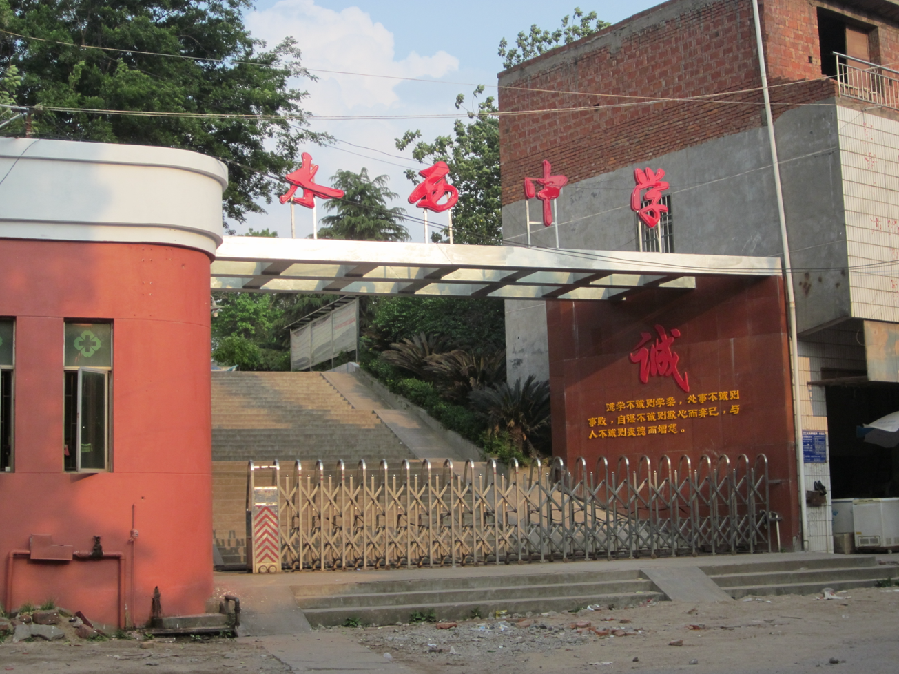
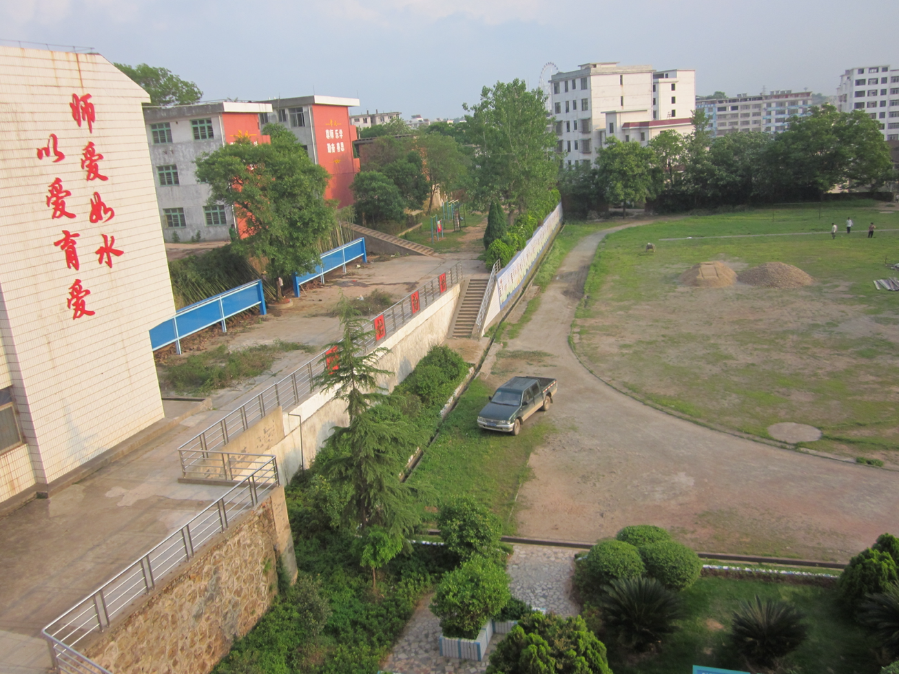
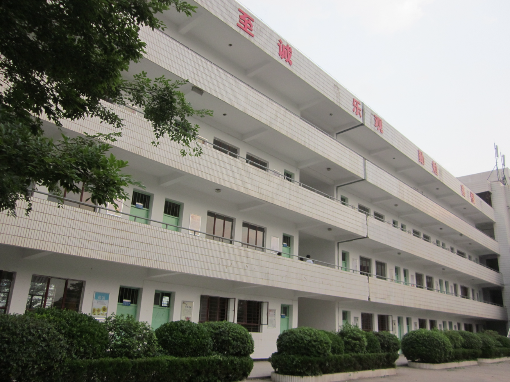
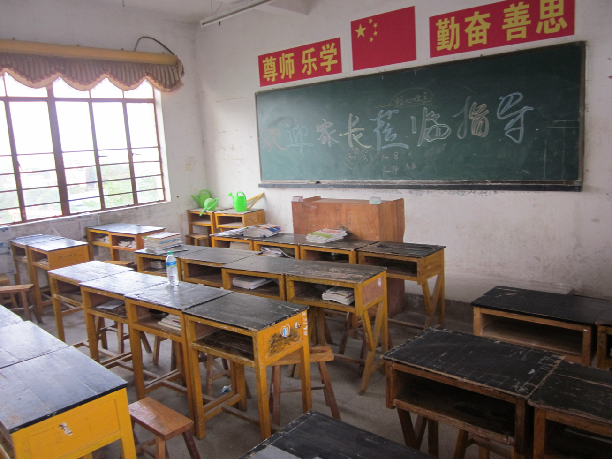
我还在这学校垫底。所以我的基础应该比大部分人差多了。
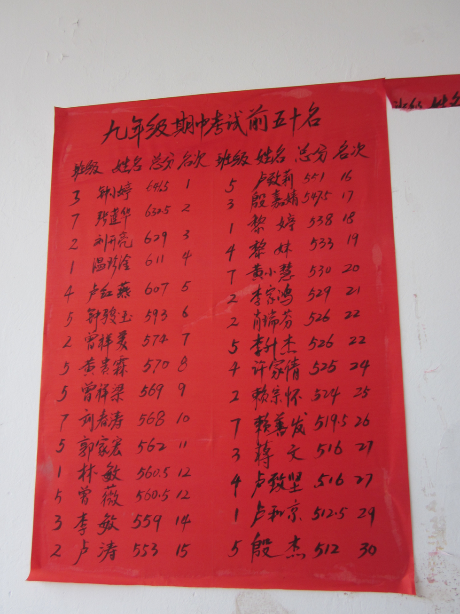
最近看那个《八角笼中》，就特别有感觉。大家都知道自己将来没什么前途，所以都破碗破摔。

像我这种闲鱼能翻身，也是因为初二的时候遇到一个好老师，教物理的。我们家之前开饭店，爸妈没空管我，所以我经常逃课去玩街机。我早上卖4个包子，能赚一块钱，然后在游戏厅能玩一天。

然后有一天，我们老师跑我们家店里来找我爸，说你不能忙着挣钱，不管娃学习。然后我就被按着学习了一段时间。
我当时只是稍微做了一些简单的练习题，抄一抄答案，然后考试就名列前茅了。主要也是我们班太烂了，根本没几个认真学的。然后我们马上物理老师对我一顿猛夸。我当时太开心了。后面就一门心思搞学习。有的时候，你要戒一个瘾，最好的办法就是在另一个地方上瘾。不要对抗人性。这样既不快乐，这不会有好结果。

所以我就这样一路充一个小混混逆袭到年级第一。很多好学生说之前都不认识我，怎么突然就冒出来就。虽然我说得很轻松，但那段时间，我还是很拼命的。我爸妈看我这么认真也不让我放牛割鱼草做家务了。

这都过去二十多年了。到现在，我也经常跟人说，大部分人其实都不用拼天赋，你瞄准一个目标，不管什么目标，其实你只要稍微努努力，就能超过大部分人。所以不要抱怨环境有多烂，也不要抱怨出生不行，也不要怪运气不好。你要怪自己，怪自己不够努力，这样才能不断积累经验，不断进步。当然，有人给你指点指点就更好了。能让你少踩坑，少走弯路。我要是没遇到那个物理老师，我也肯定凉凉了。

## 高中

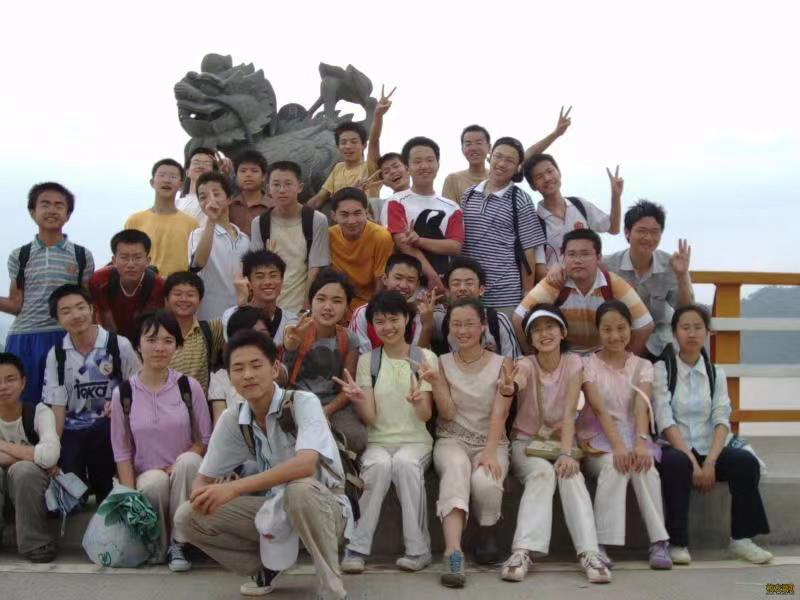

我上高中后，我又迷恋上网吧。在网吧听歌，泡网站，看电影，打小游戏。经常在网吧通宵过夜。
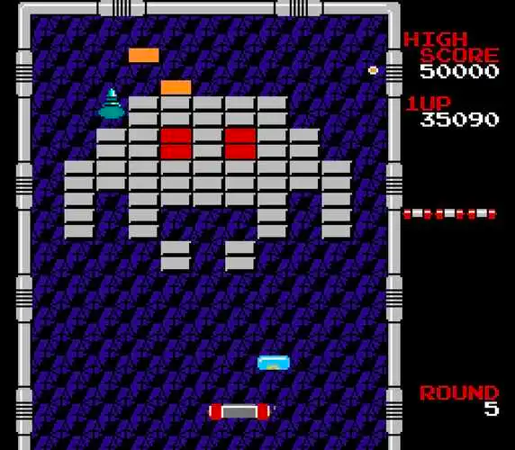
所以学习成绩又掉车尾了。本以为我这一辈子也就那样了。没想到还有更惨的。像我们这种18线走出来的小镇做题家，真是太难了。

在高一下学期的时候，我爸就查出得尿毒症了。这个事只有我的亲戚和几个老师知道。之前不愿意跟大家说，因为我比较要强，不希望大家同情我，把我当另类。不知道大家能不能理解这种心态。但我最近心态变了很多。因为我现在也是为人父母，算是家里的顶梁柱了。也算是翻过这一篇了。

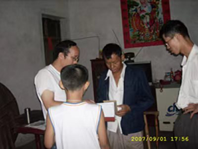
这个尿毒症很长一段时间都是我们家的噩梦。因为我爸得了这个病，干不了活，家里没收入。然后还得家里人每隔一两礼拜带去医院做几个小时透析，很费事。我就经常周末在医院过夜，陪我爸透析。然后这病还非常费钱。一次透析大几百吧。我们家也从小康水平直线下滑到亲戚都不愿意借钱。我在学校也没钱吃饭，所以经常吃泡面。有一次因为没睡好，改在学校晕倒了。大家应该没经历过这种痛苦。

我们家的事我们老师应该不知道。也可能是我不知道他们知道。我们班主任，也是各种物理老师，看我成绩掉车尾，经常来我们宿舍查房。大晚上八九点来学校也挺辛苦的。我们学校不是封闭学校。老师都正常上下班。只有我们几个县城或者郊区比较远的才住校。我是我周末回家。其他人基本上一学期回一次。我们班主任人查房不只是因为我了。我们宿舍还有叫许森洪的。我是钟辉，他是深红。他经常去网吧通宵打魔兽，成绩也比较烂。宿舍另外6个都很厉害。年级前十有一半都在我们宿舍。后面好几个考上985。有个室友现在在华南理工教数学，我前几天刚联系过。

因为我们班主任经常查房，所以我也只能老老实实去上自习了。上自习的时候经常想，人活着为了什么。各种东西，生不带来，死不带去，读书赚钱到底为了啥？

当时看了本小说叫平凡的世界。这书特别厚，而且有好几本。讲的是黄土高坡的穷小子逆袭失败的故事。我是典型的南方客家人。我当时都不知道啥是馍馍。但是这书看得津津有味。我感觉这本书就在写我。懵懂的心灵在小说里等到寄托。还有毕淑敏的红处方。还有钱钟书的各种少儿不宜的小说，我都看得津津有味。
所以真的，你想戒掉一个瘾，最好的办法是再另外一个地方上瘾。

虽然看了那么多书，但我现在也没想通人活着是为了什么？这应该也是千百年来，人类共通的问题吧。我要是真想通了，我可能也是个哲学大师了。不过不管怎么样，通过不断思考活着为了啥，我应该是比较轻松的跳过了冯友兰的自然境界和功利境界。因为不管活着为了啥，死了真是啥都没了。能留下来的只有你对身边亲戚朋友的影响，对社会的贡献。所以我还是比较传统得儒家思想，修身齐家治国平天下。西方的马克思也说人是社会关系的总和。

虽然不知道将来要干嘛，但为了活得更有意义，我得好好读书，好好挣钱。将来才有能力做自己想做的事情。这是高二时候的想法。

我从那开始，又开始拼命学习了。

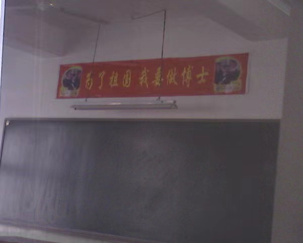

走路都在拿着卡片背单词。吃饭都觉得浪费时间，所以吃得飞快。各科的成绩抖突飞猛进。我一直觉得目标很重要。人要是没目标，跟闲鱼真没区别。你要有了目标，那你就是打不死的小强。不管失败多少次，最终都会成功。而且每天过得很充实。

我影响深刻的是高二暑假。我们赣州挨着广东，天气特别热，我天天吹着电风扇，在饭桌上把物理竞赛的七八本砖头啃完了。各种竞赛题，大学物理，高等数学，都看了一遍。最后数学竞赛拿了全国三等奖。物理竞赛是一等奖，全省第八名。当时大家都震惊了。因为我们赣州根本就没有竞赛培训，这种奖项一般都是北边的南昌九江鹰潭的牛校包揽。所以我能拿到全省第八，很长一段时间都是我们学校的骄傲。

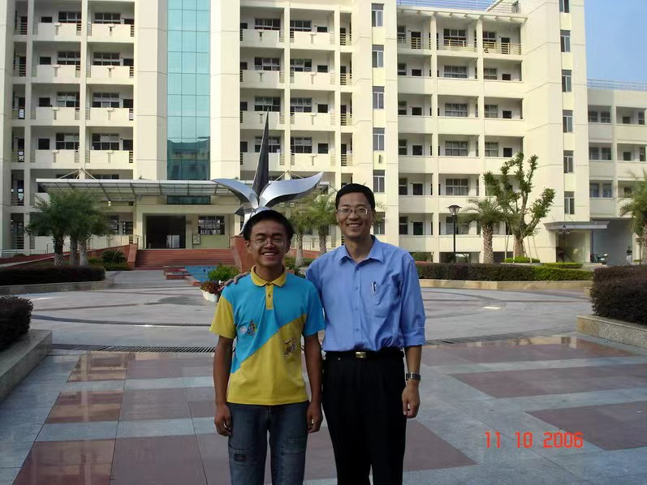
很多学校说的，今天你以学校为荣，明天学校以你为荣。这句话我是体验了好几次了。所以年轻人要有自信。只要你努力，将来你的同学、朋友、家人、亲戚都会以你为荣。

我们当时竞赛拿一等奖可以保送。我在众多学校里选了中科大。因为科大的物理是全国顶尖的。不过，最后填志愿的时候被我们物理老师劝退了。他说学物理没前途。所以我最后选了计算机。这是一个重大选择。真的是选择比努力更重要。我可能物理数学有天赋。但我可能没有资格学。我不知道大家能不能理解。农村贫苦人家出来的孩子确实没有太多选择。我们家，我们村，我们学校好不容易把我培养出来。等我毕业了，我有很大责任去挣到足够的钱。这样才能改善家庭，帮扶相亲，回馈社会。物理专业看起来不是一个很好的选择。而且不只物理专业，大部分专业，单靠自己，不拼爹，要想发家致富，都挺难的。我到现在都挺感谢我高中的那些老师。他们给我开了天窗，让我这个农村娃开挂，直接进入了信息时代。计算机行业经历了PC时代、互联网时代、移动互联网时代，到现在开始分叉，不断融入各个产业，开始有区块链、无人驾驶、智慧医疗，AI大模型，依然是很多小镇做题家发家致富的润土。所以我一直推荐没什么背景，又想通过自己干一番事业的人学计算机。

## 本科

这次保送对我的影响不止是在学习上。也让我们家摆脱了经济上的困难。我们赣州市因为教育资源不好，所以没几个能上考985。然后大家看我们家这么困难，好多好心人和机构，给我们家捐了不少钱。总共加起来有四五万。这在当时真是一笔巨款。而且是雪中送炭。我们家是真穷得不行了。我真的非常感谢他们，感谢国家。我到现在其实也捐了不少钱。也给国家交了不少税。我洗完后面也能帮更多人，把这份传递下去。

当然，我还要再感谢一下我的母校科大。每年五千八的学费，助学贷款就能完全覆盖。相当于读书不要钱。而且还有各种奖学金助学金。吃饭还有各种隐形补助。就是看你吃饭节俭，每个月系统自动给你发邮件，让你去领饭补。不需要申请，也不会有老师同学知道。真是太懂我们这些穷苦同学的面子了。上大学之后，我就没要过家里的钱了。最困难的一段时间出去当过一段时间家教。一个小时一百块钱，一天能赚五六百。这也是第一次让我感受到，知识改变命运。经济独立后，我爸妈很多事也都听我的了。我慢慢成为了家里的顶梁柱。

我在科大的表现就比较普通了。因为我基本上都是在写代码。各种坦克游戏，各种操作系统，各种数据库，各种CPU，都自己手写过。
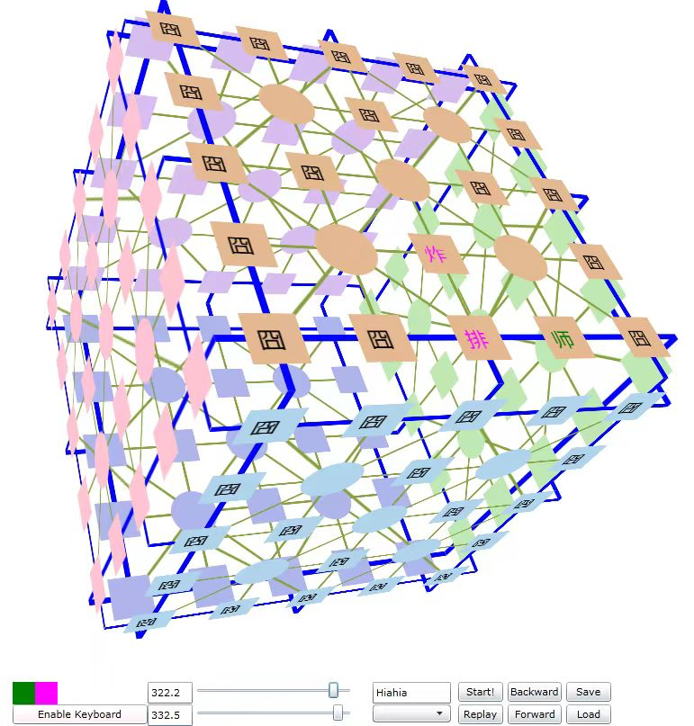

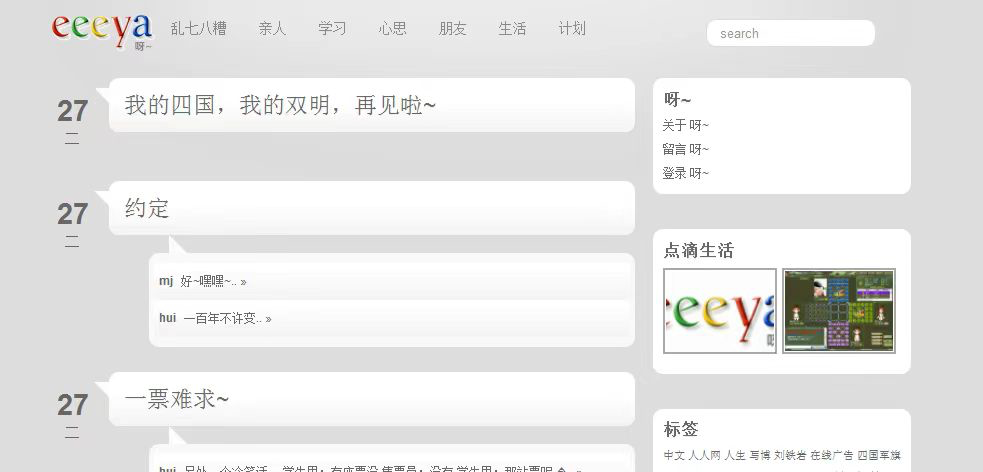

当时科大计算机也是在学国外搞改革。搞了个华夏班。我是第一批小白鼠。这个班除了传统的八股文，还有各种大作业。那种一搞就好几个月的那种超级大项目。比大部分程序员的工作还难。所以我说我在抖音还没见过比我更牛逼的程序员。抖音里大部分程序员博主写的代码估计还没我大学写得多。

我后面也是凭着过硬的代码能力进了微软亚洲研究院。我当时的GPA并不是班里最好的。我们mentor说当时招我，也是因为看我代码能力比较强。所以人还是要有看家本领。特别是在你啥都没有的时候，你能把活干好，就是一个巨大的优势。能让你获得许多珍贵的机会，接着往上爬。

我进微软后，也是各种撸代码。
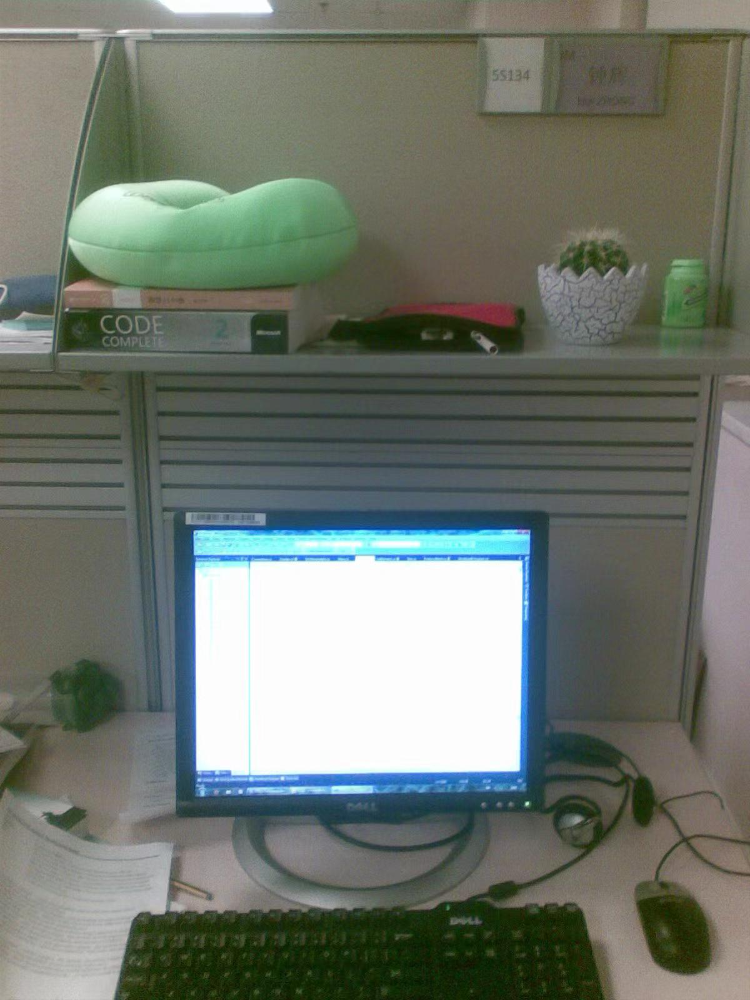

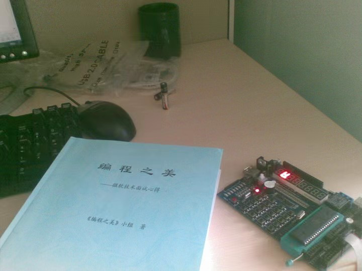

十几年前就在搞几十台服务器的集群了。好几个TB的数据，几百GB的内存。
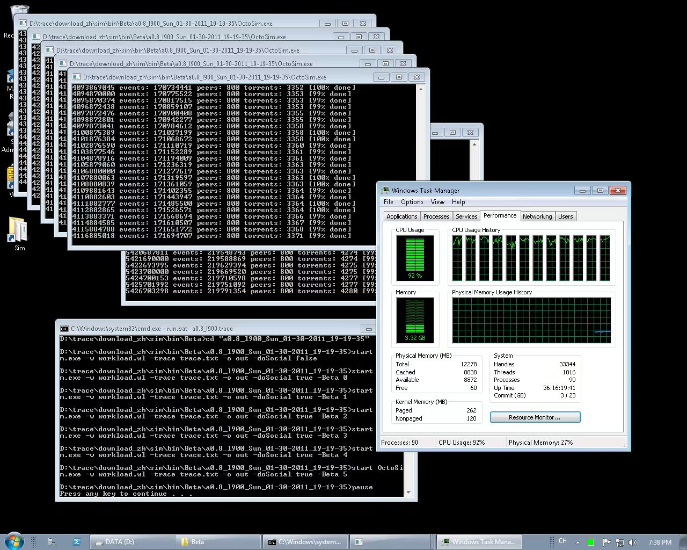

如何处理海量数据还发了篇博客，上了热搜。
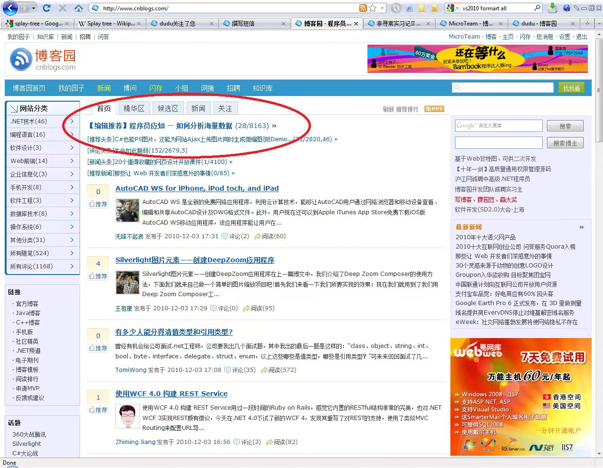

我当时研究的是P2P下载。后面发了一篇论文。也是这个论文把我搞得怀疑人生了。因为之前一直想当科学家。但真当我做研究发论文的时候。我深深地感觉到，搞研究不是我的菜。研究大半年，就为发一遍可能几年后才能应用的论文，太没有成就感了。而我很明显是很需要成就感的人。我更感兴趣的应该还是计算机应用。造各种东西，立刻马上影响千万上亿的用户。这才是我的菜。

## 硕士

所以后面选择保研去中科院计算所，不搞研究，造CPU去了。我知道现在很多研究生都很水。所谓的读研，其实就是免费帮导师干活。而且很多活都很low，给别人做系统，一锤子买卖，跟外包差不多。做这种项目，练练手还行，持续干就没什么收获了。我在中科院其实也差不多，大一上课，大二开始就进厂干活了。但是计算所的活更正规更高大上一点。干活签劳务合同，每个月发三千八的工钱。虽然现在看起来不多，但对我来说是一笔巨款了。至少衣食无忧了。人还是得挣钱，赚钱才有家庭地位，才有社会地位。从那个时候开始我在家庭的地位是立起来了。

进龙芯之后发现我们国家的芯片还是太落后了。造出来的CPU跟玩具似的。跟主流的intel amd芯片差距非常大。当时还有很多芯片造假的。有人说造芯片就是骗国家钱。当时大家都很悲观。但是我非常印象深刻的是，龙芯的胡总，也是我师兄，在年会上说，我们龙芯就是要一步一个脚印把通用CPU搞起来。我们科大的校训是又红又专。龙芯是非常符合这个标准的。从02年到现在，二十多年过去了，龙芯也确实做到了。现在龙芯最新的芯片跟intel差距也就两三年了。很期待后面能用户龙芯的高性能电脑。除了这个芯片，龙芯更重要的是给我们国家培养了很多芯片人才。AI芯片上市公司寒武纪就是从计算所孵化出来的。龙芯自己也在去年上市了。

我当时也有荣幸主导了一个芯片的指令模拟器开发。芯片设计开发跟普通软件不一样，基本上一年就流片一次。一次花费上亿。跟造火箭似的。所以要保证万无一失。是真的万无一失，百万千万无一失。芯片流完再发现问题，那责任巨大。我的工作就是做一个模拟器，芯片还没流片，先在我的模拟系统上跑各种程序，看看功能没有问题，性能有没有提升。我的硕士论文也是研究的这个。我毕业答辩的时候，有一个评委就是寒武纪的CEO。

当时评委老师特别想让我留下来读博士。但我还是跑了。

不是我不喜欢造芯片。是当时芯片行业英特尔一家独大，整个行业薪资不高，也就一万左右，而且成长比较慢。我当时也看不到芯片行业的未来。然后当时互联网如火如荼，薪资也高一大截。所以我就转去互联网搞钱了。人生有好多岔口，其实不好说谁对谁错。走哪条路取决于你当时的目标。你只要选择离你的目标近一点路就不好了。不用犹豫也不要徘徊。优秀的人修炼的其实也是这种重大问题的决策能力。很多人在小问题上精打细算，在大问题上搞不清楚，就凭感觉拍脑袋，或者听别人的意见。这个很容易走弯路。我总结的经验是，尽可能收集全面的信息，然后反复权衡各种利弊分析，然后再加上一些未来的预判，最终做一个最优的决定。

现在芯片比较火，有人问我芯片转互联网后不后悔。我想说，没人能预测十年后会发生什么。芯片之前冷门了十几年，也就火了两三年，后面还不知道能火几年。互联网已经火了二十多年了。所以我的选择是没有问题的。就算我当时没转互联网，也可能转其它行业。因为我很明显没法在一个冷门行业待十几年。别说十几年了，一两年我都受不了。我还是比较短视的。我要是做个事，很就没效果，我大概就会换方向或想其它办法了。人还是要有自知之明。我经常听别人后悔之前没有走另外一条路。其实，就算你当时走了另外一条路，你也不一定比现在好。一条路走不好，另外一条路大概也走不好。所以别怪运气，要怪就怪自己。这样你才能总结经验，不断提升自己。

从龙芯出来后，我就去美团了。当时的部门讲平台业务部。

当时开水团的总部跟梅赛德斯奔驰在一个园区里。我们这些屌丝经常过去拍照装逼

因为百度阿里腾讯这种公司太成熟了。去了只能打螺丝。我想去快速成长的公司，这样能全面锻炼自己的能力。

然后我的能力也确实得到了全面的锻炼。先是搞kafka，搭建消息队列平台。这个平台也是支撑美团业务快速增长系统不会崩掉的关键技术。搞完消息队列后又去搞营销系统。高并发的大系统。两小时发几亿张券出去，QPS上万。还有各种活动系统，一周上线十几个活动。搞完这些我基本上掌握了主要分布式系统的搭建。然后接着自己研究美团的发布系统、运维系统、任务文档系统。再后面跟着前端同学业余写一些前端代码。搞这么多东西并不是我很聪明，而是美团大部分同学七八点下班，而我经常卷到十一二点。我在美团旁边的望京花园租了个房子，除了睡觉基本在公司写代码。

所以我一直建议年轻的程序员，别抱怨工作不好找，看看自己写了多少代码吧。面试的题目做不出来，问题答不上来，更多还是因为代码写的不够多，项目做的不够复杂。写代码真是个熟能生巧的事情。

等我把这些搞透了，就出来创业了。

当时创业热潮，每个程序员都梦想着能上市敲钟。

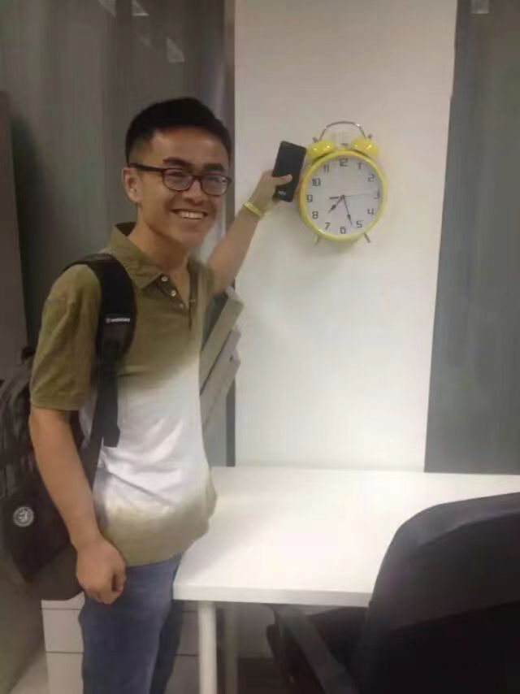

公司在三元桥远洋新干线。那边有很多证券公司。好多豪车。我们也经常去装逼。

我业余搞了个拼饭的系统，包括前端后端运维系统。其实也是验证我离开美团，能不能独立地搞定各种系统。然后各种巧合，遇到一个因为技术太弱而融资失败的团队。我就带系统入股，拿到了一笔投资。公司估值两千万。

这应该我第一个高光时刻了。几个创始人带家人一块去高档酒店泡了个澡，庆祝了一下。公司最多的时候有二三十人吧。做了好几个产品，陌生人社交，餐饮SaaS系统，营销支付系统。

也线下开了个麻辣烫店。很多项目都是差临门一脚，最后黄了。当然，也可能是差好几脚。因为你没成功，你不知道离成功还有多远。

现在看起来，我们当时还是产品和技术太强势，市场和运营太弱了。没抓住用户痛点，做了很多华而不实的功能，耽误了市场时机。我们做的很多东西其实都踩在风口上了，但就是没做起来。

后面也是因为要生娃了，所以找了师兄的公司安顿下来了。也是想学习一下他们是怎么成功的。写作业不如抄作业。你想不看答案，把作业都作对太难了。成功的捷径真的就是，抄作业。

我在这公司，也是一路从初创公司做到行业独角兽，准上市公司。业务增长了一百多倍。日订单量从一两万涨到两三百万，年利润过亿。这个公司很多团队都是我一手组建的，营销增长团队，LBS定位团队，大数据团队，算法团队。大家听着可能感觉很顺利，或者我运气好。我确实是运气好。所有的成功99%都是运气。个人的成功肯定得靠运气。但是每个人的运气其实都是差不多的。成功的人，能成功，还要靠另外1%的努力。像我这种不太聪明的人，只有非常努力，才能让大家觉得我很聪明，我在公司，基本上干到晚上十点后。因为公司发展太快，经常要处理各种技术难题。有的时候还需要半夜起来处理线上报警。除了学习技术。还要不断调整自己的角色，学习团队沟通和管理。因为我带团队最多的时候也一二个人。

我在公司拿了三次绩效A，收入也是在21年超过了一百万，交了16万的税。真金白银交了16万。我觉得非常骄傲。我一直觉得，能挣多少钱就代表对社会做了多少贡献。而且我还真金白银给国家交了十几万的税。

所以最后年薪超过百万，